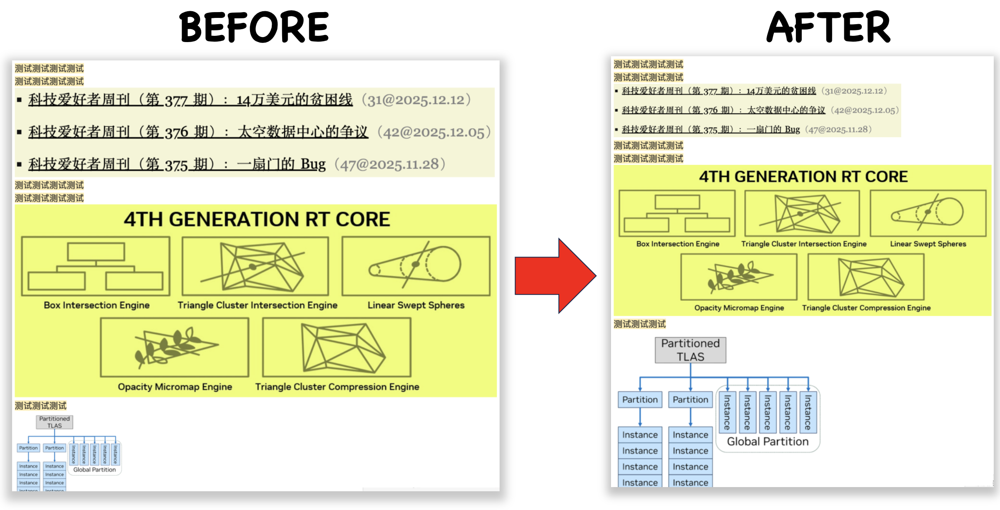

# obsidian-resize-pics

[English](./README.md) | **简体中文**

粘贴图片到文档或从网页剪藏一篇文档时，图片的原始缩放经常导致图片相对于文字过大，观感不佳，需要一一手动调整。本插件自动识别图片中的文字对应字号，自动重写图片引用格式 `![[..|W]]` / `` 里的宽度数字。



本插件的OCR功能依赖了Tesseract.js，使用前需要首先在设置页中一键缓存语言包等资源。

- **最低 Obsidian 版本**：1.4.0
- **平台**：仅桌面端（依赖 tesseract.js WASM）
- **界面语言**：简体中文 / English
- **协议**：MIT

---

## ✨ 特性

- 📏 **只改 Markdown 语法**：图片文件原封不动，只在 `![[图片.png|宽度]]` / `` 里插入或更新宽度数字
- 🔍 **OCR 测量文字高度**：用 tesseract.js（`eng+chi_sim`，LSTM 引擎）识别图片，取每行 bbox 高度的 **20% 截尾均值**作为图片内文字的像素高度
- 🎯 **匹配正文字号**：`新宽度 = round(原宽度 × 正文字号px / 图片文字高度px)`，让图内文字在渲染视图里视觉上与正文一致
- 🛡️ **原子写入**：通过 `Vault.process` 读改写，笔记在检测期间发生变化会自动放弃这次改写并提示用户重试
- 📦 **依赖延迟下载**：约 12 MB 的 Tesseract 运行时（worker + core WASM + 中/英语言模型）不打包进插件；用户按需从设置页下载到插件目录，SHA-256 全部**逐字节校验**
- 🈯 **双语 UI**：设置页可切换中/英，命令名、按钮提示文本同步刷新
- 🧹 **一键清理**：清空依赖同时会清理 tesseract.js 在 IndexedDB `keyval-store` 里我们命名空间下（`resize-pics/*`）的语言模型缓存，避免残留

---

## 🚀 安装

**手动安装（当前仅此方式）**

```
<Your Vault>/.obsidian/plugins/resize-pics/
├── main.js
└── manifest.json
```

1. 在你的 Vault 下创建 `.obsidian/plugins/resize-pics/` 目录
2. 在仓库根目录执行 `npm install`
3. 编辑 `build.sh` 里的 `TARGET_DIR` 指向上述目录，然后运行 `./build.sh` —— 会调用 esbuild 打包并把 `main.js` / `manifest.json` 拷贝过去
4. 在 Obsidian 中启用插件，然后打开设置页点击 **下载依赖项** 拉取约 12 MB 的 Tesseract 运行时

---

## 🖱️ 触发方式

打开一个 markdown文档（阅读视图 / 实时预览 / 源码模式均可），然后二选一：

- 点击左侧 Ribbon 图标  
- 命令面板 → `将图片缩放到与正文字号一致` / `Resize pics to font size`

执行结果会以 Notice 形式反馈：

```
resize-pics：已缩放 N 张图片（跳过 M 张）。
```

或在没有可缩放图片时：

```
resize-pics：当前视图中没有找到可缩放的图片。
```

---

## ⚙️ 设置项详解

设置路径：`设置 → 第三方插件 → resize-pics`

### 语言 / Language

| 值 | 说明 |
|---|---|
| `zh-CN`（默认）| 中文界面，命令名"将图片缩放到与正文字号一致" |
| `en` | English 界面，命令名"Resize pics to font size" |

切换后命令面板名称、Ribbon 悬浮提示会自动刷新（内部使用 `removeCommand` + `addCommand` 重新注册）。

### OCR 依赖项

设置页展示 4 个必需资源的状态（`已就绪 / 缺失`），并给出两个按钮：

| 按钮 | 说明 |
|---|---|
| **下载依赖项** | 从 CDN 拉取以下 4 个文件写入 `<plugin>/tesseract-data/`，全部按 SHA-256 校验；断电、失败或哈希不匹配的文件会在下次点击时自动重试 |
| **清空缓存** | 删除 `tesseract-data/` 下这 4 个文件、（如为空）删除该目录，并清空 IndexedDB `keyval-store` 中 `resize-pics/` 前缀的键 |

依赖文件清单（当前版本）：

| 文件 | 来源 | 说明 |
|---|---|---|
| `worker.min.js` | jsDelivr / `tesseract.js@5.1.1` | tesseract.js 主线程调度器脚本 |
| `tesseract-core-simd.wasm.js` | jsDelivr / `tesseract.js-core@5.1.1` | 内联 WASM 的 SIMD core |
| `eng.traineddata.gz` | `tessdata.projectnaptha.com/4.0.0_fast` | 英文语言模型 |
| `chi_sim.traineddata.gz` | 同上 | 简体中文语言模型 |

版本号与哈希在 [src/tesseractDeps.js](src/tesseractDeps.js) 顶部的 `REQUIRED_ASSETS` 数组中集中定义。

---

## 🏗️ 工作流程

```
 ┌──────────────────────────────────────────────────────────────┐
 │  用户点击 Ribbon / 触发命令                                   │
 └────────────────────────────┬─────────────────────────────────┘
                              │
                              ▼
 ┌──────────────────────────────────────────────────────────────┐
 │  main.js · ResizePicsPlugin.resizePicsToFontSize()            │
 │  · 校验：非并发 / 无依赖任务在跑 / MarkdownView 有 file       │
 └────────────────────────────┬─────────────────────────────────┘
                              │
                              ▼
 ┌──────────────────────────────────────────────────────────────┐
 │  src/resize.js · ResizeImagesJob.run()                        │
 │  · 读取正文字号 bodyFontPx（getComputedStyle）                 │
 │  · vault.read() 取当前笔记内容                                 │
 │  · metadataCache.getFileCache() → embeds + sections           │
 └────────────────────────────┬─────────────────────────────────┘
                              │
                              ▼
 ┌──────────────────────────────────────────────────────────────┐
 │  src/getPics.js · PicSource                                   │
 │  · collectReferences(embeds, sections)：                       │
 │      本地 (embeds) + 外链 (安全 section 里的正则扫)             │
 │      合并、按 start 倒序、去重叠                                │
 │  · resolve(edit) → {kind, tfile|bytes, dims, ...}              │
 │      - 本地：getResourcePath + loadImageDimensions             │
 │      - 外链：requestUrl 最多 3 次 + blob URL 取尺寸             │
 └────────────────────────────┬─────────────────────────────────┘
                              │
                              ▼
 ┌──────────────────────────────────────────────────────────────┐
 │  ResizeImagesJob.rewriteContent() — 只负责缩放                 │
 │  · 遍历 edits，按 picSource.resolve().kind 分派                 │
 │  · imageTextHeightDetector.ensureWorker() 首次懒加载 worker     │
 │  · detect({bytes | resourcePath}) → 行高数组 → 20% 截尾均值     │
 │  · newWidth = round(naturalWidth × bodyFontPx / textHeightPx)  │
 │  · 按 wikilink / standard 两种语法回写 size 段                 │
 └────────────────────────────┬─────────────────────────────────┘
                              │
                              ▼
 ┌──────────────────────────────────────────────────────────────┐
 │  vault.process(file, current => {                             │
 │     if (current !== original) 冲突 → 放弃                      │
 │     else return newContent                                    │
 │  })                                                           │
 └────────────────────────────┬─────────────────────────────────┘
                              │
                              ▼
                    ✅ Notice：已缩放 N 张（跳过 M 张）
```

---

## 🧱 代码结构

```
resize-pics/
├── manifest.json              # 插件元数据
├── main.js                    # esbuild 构建产物，供 Obsidian 加载
├── package.json               # 构建、检查、测试脚本
├── build.sh                   # 一键构建 + 拷贝到目标 Vault 插件目录
│
├── src/
│   ├── main.js                # 插件入口、命令注册、Ribbon
│   │                          #   · ResizePicsPlugin（生命周期 + 并发闸门）
│   │
│   ├── settings.js            # 设置存储 + 设置面板 UI
│   │                          #   · LANGUAGE_OPTIONS         (中/英双语文案)
│   │                          #   · SETTINGS_SCHEMA_VERSION  (=1，未知版本拒绝加载)
│   │                          #   · ResizePicsSettings       (load/save 快照式并发)
│   │                          #   · ResizePicsSettingTab     (UI + 状态刷新 + 下载/清空)
│   │                          #   · bilingualError           (语言未定前使用)
│   │                          #   · localizedError           (语言已定后使用)
│   │
│   ├── getPics.js             # 图片发现 + 拉取字节（不含 OCR / 不含改写）
│   │                          #   · IMAGE_EXT_RE / OCR_SUPPORTED_EXT_RE
│   │                          #   · EXTERNAL_URL_RE / EXTERNAL_HTTPS_RE
│   │                          #   · SAFE_SECTION_TYPES = {paragraph, list, blockquote, callout}
│   │                          #   · EXTERNAL_FETCH_MAX_ATTEMPTS=3、BACKOFF_MS=200
│   │                          #   · collectImageReferences         (embeds → 编辑列表)
│   │                          #   · collectExternalImageReferences (sections → 编辑列表)
│   │                          #   · fetchExternalImageBytes        (requestUrl + 线性退避)
│   │                          #   · loadImageDimensions[FromBytes] (URL 或 blob URL 通路)
│   │                          #   · PicSource                       (collectReferences + resolve)
│   │
│   ├── resize.js              # 缩放主流程 + Markdown 语法回写
│   │                          #   · CONTENT_ROOT_SELECTORS   (阅读/编辑视图字号来源)
│   │                          #   · MAX_SCALE_RATIO=10       (双向 clamp)
│   │                          #   · rewriteWikilinkInner / rewriteStandardAlt
│   │                          #   · ResizeImagesJob          (run / rewriteContent / dispose)
│   │
│   ├── ocr.js                 # tesseract.js 集成
│   │                          #   · CACHE_PATH="resize-pics" (IDB key 命名空间)
│   │                          #   · MIN_LINE_CONFIDENCE=60、MIN_LINE_HEIGHT_PX=4
│   │                          #   · MIN_LINES_REQUIRED=2、TRIM_FRACTION=0.2
│   │                          #   · ImageTextHeightDetector  (detect({bytes} | {resourcePath}))
│   │                          #   · idbPutAll / evictOcrCache (seed & 清理 IDB)
│   │
│   └── tesseractDeps.js       # 依赖资源清单 + 下载 / 校验 / 清理
│                              #   · REQUIRED_ASSETS          (name + url + sha256)
│                              #   · TesseractDependencyManager
│                              #     - checkStatus({verifyHash})
│                              #     - downloadAll(onProgress) (case A/B/C 分支)
│                              #     - clearCache()             (含 IDB 清理)
│
├── ut/
│   ├── main.test.js           # 插件级：命令注册、Notice 文案、并发闸门
│   ├── getPics.test.js        # 图片发现 + 拉取：PicSource.collectReferences / resolve
│   ├── resize.test.js         # 编辑器级：Markdown 语法改写规则 + OCR 记账
│   ├── settings.test.js       # 设置页：状态刷新、按钮状态、下载/清空回调
│   ├── tesseractDeps.test.js  # 依赖管理：case A/B/C、cancel、IDB seed 后清理
│   ├── concurrent.test.js     # 并发/生命周期：unload 期间收敛所有异步
│   └── helpers/               # 测试基础设施
│       ├── bootstrap.js       #   · 假 obsidian 模块 + 全局 DOM/IDB/requestUrl stub
│       ├── fakePlugin.js      #   · 可替换的 plugin/app/adapter/vault 假体
│       └── loadTesseractDeps.js
│
├── LICENSE                    # MIT
└── README.md / README.zh-CN.md
```

---

## 🔐 安全设计

- **依赖资源整链校验**：所有 Tesseract 运行时文件在写入磁盘、以及每次 `checkStatus()` 时都会重新算 SHA-256 与 `REQUIRED_ASSETS` 中的常量比对；不匹配 → 从磁盘删除、报为失败，用户点下一次"下载"才会重试。跨版本/供应链投毒的老文件不会被静默使用
- **IDB 命名空间**：tesseract.js 默认把 traineddata 写在共享的 `keyval-store/keyval`；本插件的键统一带 `resize-pics/` 前缀，清理时用游标 + `startsWith` 精确删除，不会误删其他插件的条目
- **原子写入笔记**：使用 `Vault.process(file, updater)` 原子写入接口，让 Obsidian 底层做冲突检测；`current !== original` 时直接放弃写入并 Notice 用户"检测期间不要编辑文件，请重试"
- **表格单元格内不写裸竖线**：Markdown 表格里 `|` 是列分隔符，size 段必须转义成 `![[img.png\|800]]` —— 裸竖线会把单元格切开、让该行列数超出表头，表格结构与图片引用会一起断裂。是否位于表格由 `cache.sections` 中 `type: "table"` 的范围判定，而不是"行首是不是 `|`"的启发式：后者会漏掉省略首尾竖线的表格，也会误判正文里以竖线开头的行。分段用 `/\\?\|/` 同时匹配裸竖线与转义竖线，把已转义的 size 先归一化再写回，否则二次运行会累积反斜杠（`a.png\` + `\|`）。`sections` 不可用时不猜测表格，保持原有的裸竖线输出
- **`cacheMethod: "readOnly"`**：tesseract 内部 init 失败时会尝试 `del()` 掉传入的 traineddata IDB 键；只读模式关闭这个副作用，保住我们预填的字节
- **同源限制的绕行**：Obsidian 主渲染器 `app://obsidian.md` 无法直接 `new Worker("app://<vault-uuid>/…")`；插件先用 `adapter.readBinary` 把 4 个二进制读进主线程内存，再用 `URL.createObjectURL` 包装 worker 和 core（Blob URL 继承创建者 origin），彻底绕过跨 origin 限制
- **未加载 / 卸载防御**：`onunload` 会同步翻转 `__resizePicsUnloaded` 与 `_lifecycleGeneration`，所有异步任务在每个 await 点检查两者；即使晚返回也不会写入新的 Notice、按钮态或磁盘文件

---

## ⚠️ 已知限制

- **仅桌面端**（`isDesktopOnly: true`）：tesseract.js worker + WASM 依赖桌面 Electron 环境
- **可 OCR 的格式**：`png`、`jpg` / `jpeg`、`webp`、`bmp`。文档里被 Obsidian 认为是图片但 tesseract 无法解码的格式（`gif`、`svg`、`avif`、`tiff`）会被计入"考虑过但跳过"
- **外链图片按需下载识别**：`` 不在 Obsidian 的 `metadataCache.embeds` 里，插件通过扫描 `cache.sections` 中的正文段落（`paragraph`/`list`/`blockquote`/`callout`）识别外链，再用 `requestUrl`（Obsidian 内置的 CORS 免疫 HTTP 客户端）下载，每张图最多重试 3 次，随后走与本地图完全相同的 OCR + 缩放公式；`file://` / `app://` / `data:` 等非 http(s) URI 仍然跳过
- **规模钳制**：`bodyFontPx / imageTextHeightPx` 的比例被限制在 `[1/10, 10]` 之间；超出这个范围的图片被识别为"文字高度极端异常"（多半是 OCR 误识 1px 噪点），跳过
- **要求 ≥ 2 行有效文本**：单行文本样本量太小，容易被误识别的行拉偏均值；少于 2 行的图片跳过
- **锚点检测最少置信度 = 60**：单行低于此置信度会被丢弃；虚线边框、JPEG 分块伪影、单像素点很容易被 tesseract 当作 1-px 高的"文字"
- **依赖版本硬编码**：`REQUIRED_ASSETS` 里的 URL + SHA-256 是完全固定的；升级 tesseract.js 需要同时刷新两组值

---

## 🐛 常见错误 / 提示消息

| Notice / Exception | 说明 / 处理 |
|---|---|
| `resize-pics：请先打开一个 Markdown 视图。` | 当前无活动 Markdown 视图，或视图没有绑定文件 |
| `resize-pics：当前视图中没有找到可缩放的图片。` | 视图内没有可 OCR 的本地图片（外链、非图片扩展名、缓存未构建等） |
| `resize-pics：检测期间不要编辑文件，请重试。` | 在 OCR 过程中笔记内容被修改，`Vault.process` 检测到冲突并放弃写入 |
| `resize-pics：OCR 依赖项未就绪（缺少 X/Y：…）；请在设置中下载。` | 触发 OCR 时发现缺文件，需先去设置页点"下载依赖项" |
| `resize-pics：获取正文字号失败。` | 视图容器里既没有 `.markdown-preview-view` 也没有 `.cm-content` |
| `resize-pics：获取正文字号非法。` | computed `font-size` 不是正有限数（异常主题？） |
| `resize-pics：当前 Obsidian 不支持原子文件更新 API（Vault.process）；请升级 Obsidian。` | Obsidian 版本过低，缺少 `Vault.process` |
| `resize-pics：Obsidian 不支持读取插件目录中的依赖文件。` | 当前 adapter 没有 `readBinary`（移动端 / 极端环境） |
| `resize-pics：不支持的配置文件版本 X；期望值为 1。` | 用旧版本的 data.json + 新版本插件；需要清空 data.json 或降级 |
| `resize-pics：依赖下载部分失败：X/Y（…）。` | 见 DevTools 里 `resize-pics: dependency download failures` 结构化日志 |

---

## 🛠️ 开发说明

- **打包构建**：Obsidian 只加载插件目录里的根 `main.js`，其他 `require` 出来的 JS 文件在 Obsidian Sync 场景下不会同步。本仓库把源码放在 `src/`，通过 `npm run build`（esbuild）把整个依赖图打包成根目录的 `main.js`
- **一键 build + 分发**：`build.sh` 编辑顶部的 `TARGET_DIR` 后可以一键 `npm run build` 并把 `main.js` / `manifest.json` 拷贝到目标 Vault 的插件目录
- **测试**：`npm test` 使用 Node 内建的 `node --test`；无外部测试框架
- **package.json 脚本**：
  - `npm run build` — esbuild 打包
  - `npm run check` — build + `node --check main.js`（语法自检）
  - `npm test` — 运行 `ut/*.test.js`
- **调试日志**：所有 `console.log/error` 前缀统一为 `resize-pics:`；在 Obsidian 开发者工具里过滤即可

### 关键常量

| 常量 | 值 | 位置 |
|---|---|---|
| `PLUGIN_VERSION` | `0.2.0` | `src/main.js` |
| `RESIZE_COMMAND_ID` | `"resize-pics-to-font-size"` | `src/main.js` |
| `RIBBON_ICON_ID` | `"image-upscale"` | `src/main.js` |
| `NOTICE_DURATION_MS` | `4000` | `src/main.js`、`src/settings.js` |
| `SETTINGS_SCHEMA_VERSION` | `1` | `src/settings.js` |
| `MAX_SCALE_RATIO` | `10` | `src/resize.js` |
| `EXTERNAL_FETCH_MAX_ATTEMPTS` | `3` | `src/getPics.js` |
| `EXTERNAL_FETCH_BACKOFF_MS` | `200` | `src/getPics.js` |
| `MIN_LINE_CONFIDENCE` | `60` | `src/ocr.js` |
| `MIN_LINE_HEIGHT_PX` | `4` | `src/ocr.js` |
| `MIN_LINES_REQUIRED` | `2` | `src/ocr.js` |
| `TRIM_FRACTION` | `0.2` | `src/ocr.js` |
| `OCR_LANGS` | `"eng+chi_sim"` | `src/ocr.js` |
| `CACHE_PATH` | `"resize-pics"` | `src/ocr.js` |
| `DATA_SUBDIR` | `"tesseract-data"` | `src/tesseractDeps.js` |
| `TESSERACT_JS_VERSION` | `"5.1.1"` | `src/tesseractDeps.js` |
| `TESSERACT_CORE_VERSION` | `"5.1.1"` | `src/tesseractDeps.js` |

---

## 📄 License

MIT © 2026 [QuincyLeo](https://github.com/Quincy-Leo) (Quincy-Leo)

详见 [LICENSE](./LICENSE)。
